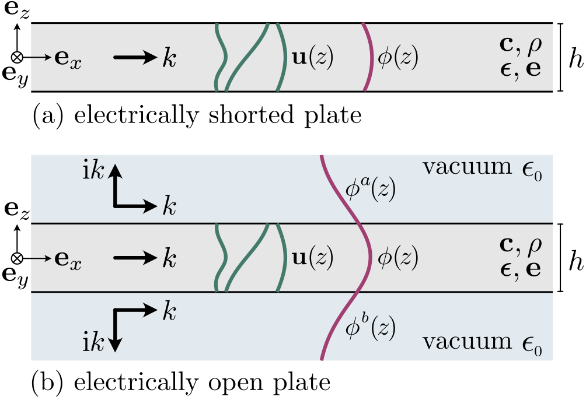
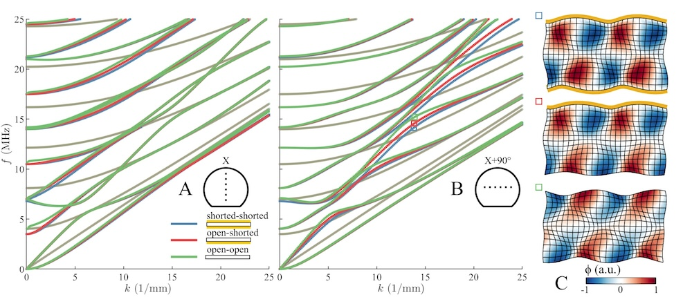

# GEW piezo plate 

**Script to compute guided waves in piezoelectric plates.** 

 [https://github.com/dakiefer/gew_piezo_plate](https://github.com/dakiefer/gew_piezo_plate)

`GEW piezo plate` is a minimal script for fast and robust computation of guided electroelastic waves in piezoelectric plates. It implements the spectral collocation method (SCM) based on DMSUITE and is an extension to [GEW dispersion script](https://github.com/dakiefer/GEW_dispersion_script). The code implements the method from 

> D. A. Kiefer, G. Watzl, K. Burgholzer, M. Ryzy, and C. Grünsteidl, “Electroelastic guided wave dispersion in piezoelectric plates: spectral methods and laser-ultrasound experiments,” Submitted. Nov. 2024.

Features:

- only ~130 comprehensive lines of Matlab code
- electrically "shorted" or "open" plate surfaces 
- arbitrary propagation direction

Piezoelectricity couples the mechanical displacement vector **u** to the electrostatic potential *φ*. We solve for these fields across the plate thickness as depicted in the figure below.

Computational results are depicted below in the form of dispersion curves. The wave field of three selected modes are also shown. 

> [!TIP]
> This is a simple script that should be easy to extend with custom functionality. If you are rather looking for a full system to compute and postprocess guided waves, have a look at [GEWtool](https://github.com/dakiefer/GEWtool). It will soon support multilayered piezoelectric plates.

## How to use

1. Change into the `GEW_piezo_plate` folder or add it to the Matlab path.
2. Execute `plate_piezoelectric_SCM.m` . Enjoy!

## How to cite 
If this code is useful to you, please cite the accompanying paper:

> D. A. Kiefer, G. Watzl, K. Burgholzer, M. Ryzy, and C. Grünsteidl, “Electroelastic guided wave dispersion in piezoelectric plates: spectral methods and laser-ultrasound experiments,” Submitted. Nov. 2024.

as well as the software itself:

> D. A. Kiefer and C. Grünsteidl (2024). GEW piezo plate. https://doi.org/10.5281/zenodo.TODO (https://github.com/dakiefer/GEW_piezo_plate)

## Dependencies

The authors are grateful for permission to bundle `chebdif.m` from DMSUITE:

J.A.C Weideman (2022). DMSUITE (https://www.mathworks.com/matlabcentral/fileexchange/29-dmsuite), MATLAB Central File Exchange. Retrieved August 18, 2022.

## Literature 
> [1] D. A. Kiefer, G. Watzl, K. Burgholzer, M. Ryzy, and C. Grünsteidl, “Electroelastic guided wave dispersion in piezoelectric plates: spectral methods and laser-ultrasound experiments,” Submitted. Nov. 2024.  
> [2] L. N. Trefethen, _Spectral Methods in MATLAB_. Philadelphia, PA: Society for Industrial and Applied Mathematics, 2000. doi: [10.1137/1.9780898719598](https://doi.org/10.1137/1.9780898719598).  
> [3] J. A. Weideman and S. C. Reddy, “A MATLAB Differentiation Matrix Suite,” ACM Trans. Math. Softw., vol. 26, no. 4, pp. 465–519, Dec. 2000, doi: [10.1145/365723.365727](https://doi.org/10.1145/365723.365727).  
> [4] A. T. I. Adamou and R. V. Craster, “Spectral methods for modelling guided waves in elastic media,” The Journal of the Acoustical Society of America, vol. 116, no. 3, pp. 1524–1535, Sep. 2004, doi: [10.1121/1.1777871](https://doi.org/10.1121/1.1777871).  
> [5] B. A. Auld, _Acoustic Fields and Waves in Solids_, 2nd ed., vol. 2. Malabar: Krieger Publishing Company, 1990.  
> [6] H. F. Tiersten, “Wave Propagation in an Infinite Piezoelectric Plate,” The Journal of the Acoustical Society of America, vol. 35, no. 2, pp. 234–239, Feb. 1963, doi: [10.1121/1.1918438](https://doi.org/10.1121/1.1918438).  
> [7] J. E. Lefebvre, V. Zhang, J. Gazalet, and T. Gryba, “Conceptual advantages and limitations of the Laguerre polynomial approach to analyze surface acoustic waves in semi-infinite substrates and multilayered structures,” Journal of Applied Physics, vol. 83, no. 1, pp. 28–34, Jan. 1998, doi: [10.1063/1.366697](https://doi.org/10.1063/1.366697).  
> [8] D. A. Kiefer, _Elastodynamic quasi-guided waves for transit-time ultrasonic flow metering_, ser. FAU Forschungen, Reihe B, Medizin, Naturwissenschaft, Technik, vol. 42. Erlangen: FAU University Press, 2022, doi: [10.25593/978-3-96147-550-6](http://doi.org/10.25593/978-3-96147-550-6). 

## Authors

Code created 2024 by:

**Daniel A. Kiefer**, Institut Langevin, ESPCI Paris, Université PSL, France  
Contact: [daniel.kiefer@espci.fr](mailto:daniel.kiefer@espci.fr) &nbsp; • &nbsp; [dakiefer.net](https://dakiefer.net) &nbsp; • &nbsp; Follow me on [ResearchGate](https://www.researchgate.net/profile/Daniel-Kiefer-5)!  
&nbsp;&nbsp;&nbsp;&nbsp;&nbsp;&nbsp;

**Clemens Grünsteidl**, Research Center for Non Destructive Testing GmbH, Austria  
Contact: [clemens.gruensteidl@recendt.at](mailto:clemens.gruensteidl@recendt.at) &nbsp; • &nbsp; Follow me on [ResearchGate](https://www.researchgate.net/profile/Clemens-Grunsteidl)!  

